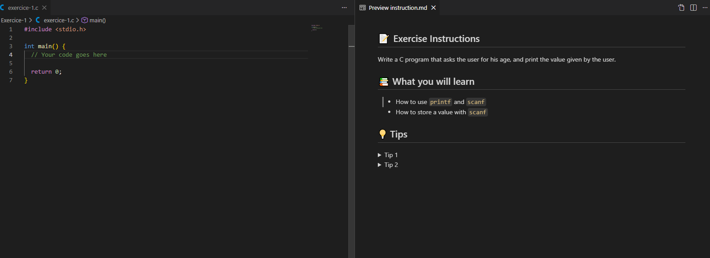

## Learn C by practice

Welcome to this repository, where you can find a structured way to learn C by practice. The exercices are simple, but not simplified. The goal is not to hide the complexity and to offer exercices with added value.

- 1: variable declaration, scanf, printf
- 2: printf and scanf, iteration
- 3: Iteration over a char
- 4: Array iteration, pointer
- 5 & 6: Pointer and Pointer arithmetic
- 7: Structure
- 8 & 9: Bitwise operators
- ...

# Installation

Go to [MYSYS2](https://www.msys2.org/#installation) and follow the steps (windows).

# Pre requisites

You should have a basic understanding of the language syntax, including some element of theory (pointers, memory allocation, ...).

A quick approach to get a good grasp of the fundamentals:

- [W3School](https://www.w3schools.com/c/index.php)
- [Programmiz](https://www.programiz.com/c-programming/getting-started)

# Tip

Right click on the `instruction.md` and click on `Open preview` and view the instructions alongside your solution.

# Contributions

Contributions are welcome. Please open a PR and improve the learning journey.
